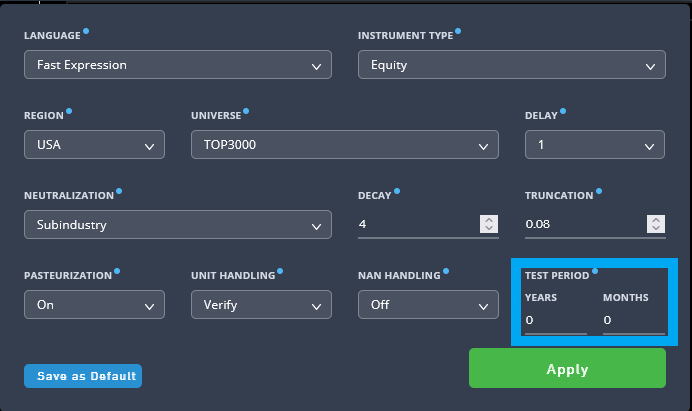
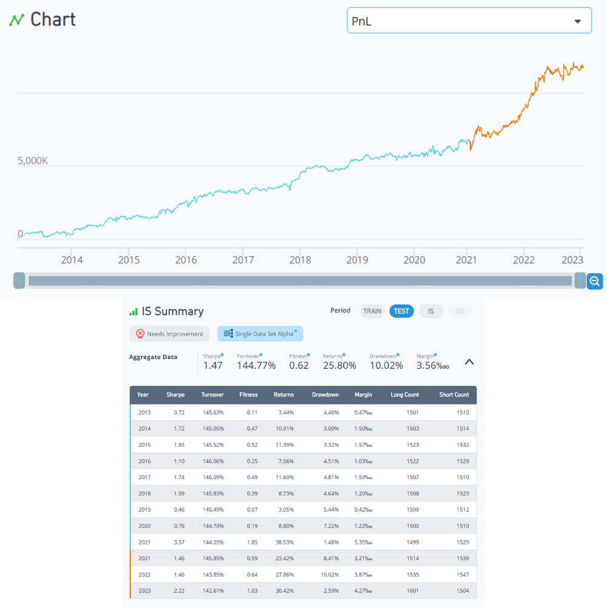

# Test Period

The Test Period is a feature designed to enhance your Alpha and SuperAlpha testing process. This tool allows you to set a separate test period from your IS period, providing a more flexible approach to testing your research ideas.

Using the Feature:

The Test Period feature is designed to help you avoid overfitting. It allows you to divide your In-Sample (IS) period into a Train and Test period. The Train period can be utilized to develop your Alphas and SuperAlphas, while the Test period is ideal for validating them. An Alpha or SuperAlpha that is developed based on the simulation results of Training Period and performs well in both periods is likely a strong candidate for submission and may have avoided overfitting.

While choosing a Test period does not directly affect the simulation, it influences the statistics and the visualization. The submission tests will run on the entire 5-year period, with the simulation running on the entire 5-year IS. However, if a testing period is chosen, the simulation stats will be divided into two sections: one covering the training period and another for the test period.

Navigating the Feature:

- Selecting the Test Period: In Simulation Settings, you can define a test period corresponding to the final 0-5 years of the IS period. By default, no test period is set (0 years).
 - Visualizing the Test Period: The Stats Summary defaults to the training period. You can view the stats for the test period by clicking on the “Show test period” button.
 - Identifying the Test Period on Graphs: The lines representing the test period on the graphs are colored orange.
 - Choosing the Stats Summary: You can select between the Stats Summary for the test period or the entire IS period by choosing the “TEST” or “IS” in the Summary section, respectively.
 - Hiding the Test Period: A button “Hide test period” allows you to hide the test period, if desired. Note that an Alpha or SuperAlpha can only be submitted when the Test Period is revealed by clicking on the “Show test period” button.
 - Understanding the Stats: The yearly IS stats are divided between Train and Test periods, represented by blue and orange indicators respectively.

A. Orange - test period PnL, Blue - Train period PnL. B. View IS summary by selecting different periods