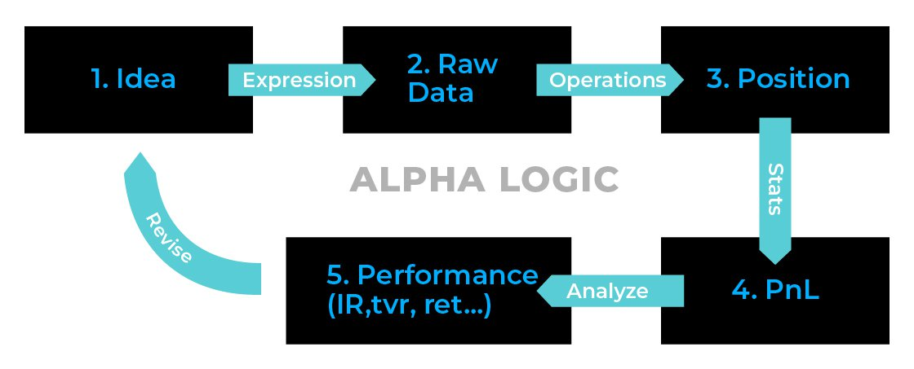
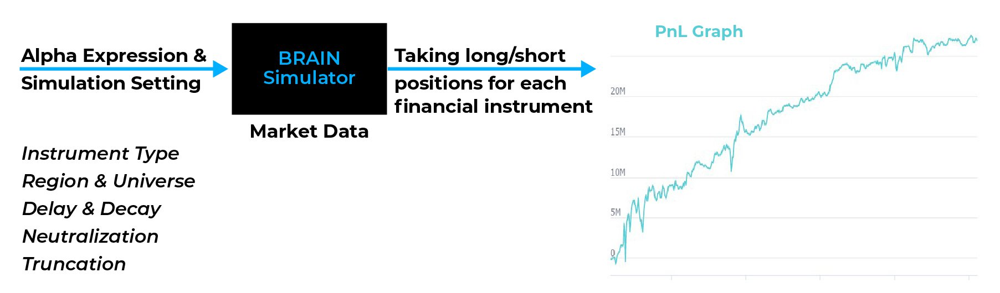

# Introduction to Alphas

BRAIN is a web-based tool for [backtesting](https://support.worldquantbrain.com/hc/en-us/articles/4902349883927-Click-here-for-a-list-of-terms-and-their-definitions#:~:text=operators.-,Backtesting,-Backtesting) trading ideas. An [Alpha](https://support.worldquantbrain.com/hc/en-us/articles/4902349883927-Click-here-for-a-list-of-terms-and-their-definitions#:~:text=A-,Alpha,-An) is a concrete trading idea that can be simulated historically.

# Alphas

In BRAIN, an 'Alpha' refers to a mathematical model, written as an expression, which places different bets ( [weights](https://support.worldquantbrain.com/hc/en-us/articles/4902349883927-Click-here-for-a-list-of-terms-and-their-definitions#:~:text=W-,Weight,-BRAIN) ) on different [instruments](https://support.worldquantbrain.com/hc/en-us/articles/4902349883927-Click-here-for-a-list-of-terms-and-their-definitions#:~:text=details.-,Instrument,-Instrument) (stocks), and is expected to be profitable in the long run. After a user enters an Alpha expression that consists of data, [operators](https://support.worldquantbrain.com/hc/en-us/articles/4902349883927-Click-here-for-a-list-of-terms-and-their-definitions#:~:text=O-,Operator,-Operator) and constants, the input code is evaluated for each instrument to construct a portfolio. Then BRAIN makes investments in each instrument for a one-day period in proportion to the values of the expression. The process repeats each day.

# Alpha Lifecycle

The flow chart below shows the lifecycle of an [Alpha](https://support.worldquantbrain.com/hc/en-us/articles/4902349883927-Click-here-for-a-list-of-terms-and-their-definitions#:~:text=A-,Alpha,-An) :

First, one might peruse blogs, journals and research papers on the internet to come up with an idea. The Alpha expression is entered in BRAIN and operations (like truncation,neutralization, decay) are performed on the raw Alpha. BRAIN makes investments (goes long or short) for all the instrumentsof the universe chosen in the Settings panel and the PnL is simulated. Then the performance is calculated (Sharpe, Turnover, Returns) as seen in the Simulation Results page. And if the Alpha is not deemed worthy, the Alpha idea is revised. Else, it enters production.

# Weights

In simple terms, BRAIN uses an Alpha to create a vector of weights, with each weight corresponding to one of the stocks in the selected [universe](https://support.worldquantbrain.com/hc/en-us/articles/4902349883927-Click-here-for-a-list-of-terms-and-their-definitions#:~:text=U-,Universe,-Universe) . These weights may or may not be market neutralized, as per your [neutralization](https://support.worldquantbrain.com/hc/en-us/articles/4902349883927-Click-here-for-a-list-of-terms-and-their-definitions#:~:text=strategy.-,Neutralization,-Neutralization) setting (by market, industry, sub-industry or none). This creates a portfolio for each day in the simulation period, which can then be used to calculate that day's [Profit and Loss (PnL)](https://support.worldquantbrain.com/hc/en-us/articles/4902349883927-Click-here-for-a-list-of-terms-and-their-definitions#:~:text=consultants-,Profit%20and%20Loss%20(PnL),-Profit) .

# Assigning weights

Suppose in the Expression box, you type in 1/close, and set the simulation settings as follows: [Region](https://support.worldquantbrain.com/hc/en-us/articles/4902349883927-Click-here-for-a-list-of-terms-and-their-definitions#:~:text=details.-,Region,-Set) = US, Universe = TOP3000, Delay = 1, Decay = 0, Neutralization = None, Truncation = 0. Now, once you hit "Simulate" button, then for each day in the Simulation Duration (5 years), the simulator does the following:
 It calculates 1/close (using the closing price for the previous day), for each [instrument](https://support.worldquantbrain.com/hc/en-us/articles/4902349883927-Click-here-for-a-list-of-terms-and-their-definitions#:~:text=details.-,Instrument,-Instrument) in the basket "US: TOP3000" (i.e. top 3000 stocks in the US, by market [capitalization](https://support.worldquantbrain.com/hc/en-us/articles/4902349883927-Click-here-for-a-list-of-terms-and-their-definitions#:~:text=level.-,Capitalization,-Daily) ). This creates a vector of 3000 values (one for each stock). This vector is then normalized, i.e. divided by the sum of its values(so that all the values sum up to 1). This creates a vector of "weights" for all the stocks, which is called a "Portfolio". Each weight represents the fraction of money invested in that stock. If our [booksize](https://support.worldquantbrain.com/hc/en-us/articles/4902349883927-Click-here-for-a-list-of-terms-and-their-definitions#:~:text=deviation.-,Booksize,-Booksize) is $20 Million, then the money invested in each stock is $20M x (weight of that stock in the portfolio). This is done for each day in the simulation period, and at the end of each day the total profit or loss made by our portfolio is calculated.

# Positive and Negative weights

BRAIN assigns positive weights to indicate long positions in stocks, and negative weights to indicate short positions in stocks. The greater the magnitude of the weight on a stock, the larger the long or short position taken on it.

It is easy to invest $100 in stock, but negative positions (shorts) are common too. E.g. one can get $100 now by shorting a stock (i.e. investing -$100), which must be bought back later. PnL would be the opposite of $100 invested, as seen in the table below. Negative weights are called short positions and positive weights are called long positions. Typically investors take short positions when they expect stock price to decrease and long positions (i.e. buying stocks) when they expect price to increase. Please refer to [Investopedia](http://www.investopedia.com/terms/s/shortselling.asp) for more details on short selling.

The below table gives an example of payoffs from a $100 short and a $100 long position, for a 1% price change in each direction. For simplicity, it does not account for dividends, margin and financing costs.

# BRAIN

BRAIN is a web-based simulator of global financial markets that was created to explore Alpha research. It accepts an Alpha expression as input and plots its Profit and Loss (PnL) as output. The input expression is evaluated for each financial instrument, every day over historical dates, and a portfolio is constructed accordingly. BRAIN invests in each financial instrument according to the value of the expression. It takes positions (either buying or short selling) and assigns weights to each instrument. The weights are then scaled to book size (amount of money invested), based on which a PnL graph is plotted. These weights are not constant; they change over time based on current information and the history of the changes of some variables (such as prices, volumes, etc.).

