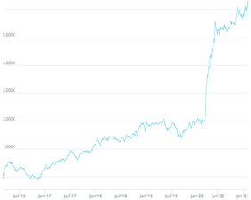

# 3. What is an Alpha? (2)
### 🧐 Taking a Detailed Look at Alpha Performance Metrics
When you simulate an Alpha, you can see various results appearing. Let's examine them one by one.

### 🔍 PnL Graph

When backtesting an Alpha, profits and losses occur based on simulation results. We call the cumulative result over the backtest period PnL (Profit and Loss), which you can view as a graph on the result section, which you can view with checking RESULTS checkbox.

### 📝 IS Summary
When you simulate an Alpha, BRAIN summarizes key performance values in the IS Summary.

### 📝 Sharpe
While the amount of profit is important, how consistently you earn it is also an important evaluation factor for Alphas. Sharpe is the measure of risk adjusted returns earned by the alpha. Higher values of Sharpe are better. Sharpe is calculated as the annualized value (*√250) of returns divided by their standard deviation: Sharpe = Avg. Annualized Returns / Annualized Std. Dev. of Returns

### 📝 Turnover
When creating an Alpha, positions change daily, and Turnover is the percentage of the capital which the alpha trades each day. More turnover may mean higher transaction costs during trading. the formula Value Traded / Value Held expresses this.

### 📝 Fitness
Fitness of an Alpha is a function of returns, turnover and Sharpe: Fitness=Sharpe * Sqrt(Abs(Returns)) / Max(Turnover,0.125)

Good Alphas have high fitness. You can optimize the performance of your Alphas by increasing Sharpe (or returns) and reducing turnover. Improving one factor normally has an adverse impact on the other factor. As you work on optimizing your Alpha, an improvement in its fitness is a sign that your changes are having a positive impact.

### 📝 Returns
Returns indicates how much profit an Alpha can generate. Since BRAIN simulations assume a long-short portfolio (which we'll explain in the next step), The total investment amount equals half of the book size.

### 📝 Drawdown
Even with good Alpha performance, significant losses can occur during certain periods. Depending on market conditions, large losses might make it difficult to continue investing in that Alpha.

Drawdown represents the percentage of the largest loss incurred during any year in your backtesting. As a practice, you should target a return-to-drawdown ratio greater than one. The higher the ratio of returns to drawdown, the better it may be for your alpha.

### 📝 Margin
Margin represents how much PnL you obtained relative to the traded amount. It's calculated by dividing total PnL by the total traded amount. Note that Margin uses basis points (bps, ‱, or ten thousandths) as its unit of measurement, not %!

### 🔥 Task
Feel free to create and simulate Alphas while paying attention to these performance metrics. You can proceed to the next step once the simulation is complete, regardless of the Alpha's content.
Simulate any Alpha you want and check the results.